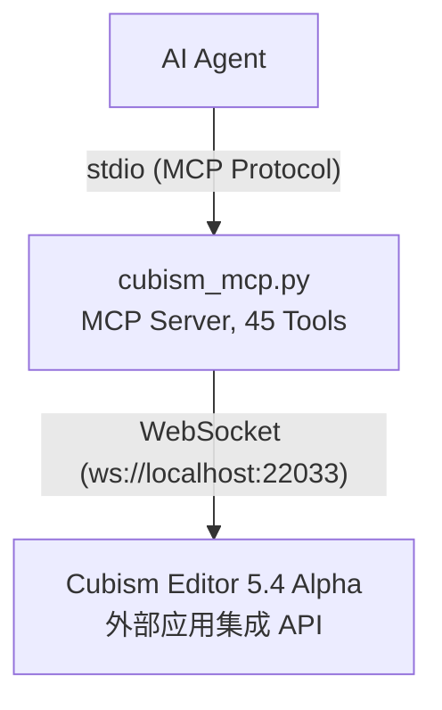

# Cubism External Edit MCP

[](https://www.live2d.com/cubism/download/editor/)
[](https://www.python.org/)
[](https://modelcontextprotocol.io/)
[](https://pypi.org/project/cubism-mcp/)

[](LICENSE)
[](https://github.com/nana7chi/CubismExternalEditMCP/stargazers)
[](https://github.com/nana7chi/CubismExternalEditMCP/commits)

[中文](README.md) | [English](i18n/README_EN.md) | [日本語](i18n/README_JA.md) | [한국어](i18n/README_KO.md)

将 Live2D Cubism Editor 的外部应用集成 API 封装为 **MCP (Model Context Protocol)** 工具，让 AI Agent 通过自然语言操控 Cubism Editor 进行建模操作。

> 官方下载及参考文档：https://creatorsforum.live2d.com/t/topic/3938

## 架构



## 功能特性

- **读写操作** — 读取/写入模型参数值、查看文档列表、获取编辑模式（适用 Editor 4.x+）
- **完整模型查询** — 参数结构、部件结构、变形器结构、单个对象详情（需 5.4 Alpha）
- **编辑操作** — 增删改查参数/部件/变形器/ArtMesh/Glue，自动事务包裹（需 5.4 Alpha）
- **批量编辑** — 同一事务内执行多个操作，任一失败自动回滚
- **权限分级** — 读写需 Allow 授权，编辑需 Edit 授权
- **自动重连** — Editor 重启后自动重连，3 秒间隔
- **Token 持久化** — 认证令牌缓存到 `~/.cubism-mcp/token.txt`，避免重复授权

## 环境要求

| 组件 | 版本 |
|------|------|
| Python | ≥ 3.10 |
| Cubism Editor | 5.4 Alpha（有效期随构建变化，以所安装版本的官方说明为准） |
| 操作系统 | Windows / macOS |

## 使用流程

### 快速开始

**复制以下提示词发给你的 AI Agent**：

> 根据 https://github.com/MurasameCyan/CubismExternalEditMCP/blob/master/README.md 完成 cubism-mcp 的安装和配置。如果电脑上还没有 `uv`，请先帮我安装。配置完成后告诉我是否就绪。


### 第一步：安装 uv（仅一次）

`uv` 是一个极小的 Python 包管理器，用于自动安装和运行本 MCP。安装后无需再管 Python 环境。

**macOS**（终端粘贴运行）：
```bash
curl -LsSf https://astral.sh/uv/install.sh | sh
```

**Windows**（PowerShell 粘贴运行）：
```powershell
powershell -ExecutionPolicy ByPass -c "irm https://astral.sh/uv/install.ps1 | iex"
```

安装完成后**重启终端**，输入 `uv --version` 能看到版本号即成功。

### 第二步：在 AI Agent 中配置 MCP

> 支持 `ClaudeCode`, `Codex`, `Workbuddy` 等各种支持MCP的客户端

> 第一次启动会自动下载依赖包，耗时约 1–2 分钟，之后秒启。

#### 方式一：PyPI 安装（推荐）

```json
{
  "mcpServers": {
    "cubism-mcp": {
      "type": "stdio",
      "command": "uvx",
      "args": ["cubism-mcp"],
      "description": "Cubism Editor MCP",
      "env": { "NO_PROXY": "localhost,127.0.0.1" }
    }
  }
}
```

#### 国内镜像源配置

如果 PyPI 官方源下载慢，可使用国内镜像（清华/阿里云/腾讯云等均可用）：

```json
{
  "mcpServers": {
    "cubism-mcp": {
      "type": "stdio",
      "command": "uvx",
      "args": ["--index-url", "https://pypi.tuna.tsinghua.edu.cn/simple", "cubism-mcp"],
      "description": "Cubism Editor MCP",
      "env": { "NO_PROXY": "localhost,127.0.0.1" }
    }
  }
}
```

> 也可替换为阿里云 `https://mirrors.aliyun.com/pypi/simple` 或腾讯云 `https://mirrors.cloud.tencent.com/pypi/simple`。

#### 方式二：uvx 在线运行（GitHub 源）

```json
{
  "mcpServers": {
    "cubism-mcp": {
      "type": "stdio",
      "command": "uvx",
      "args": ["--from", "git+https://github.com/nana7chi/CubismExternalEditMCP.git", "cubism-mcp"],
      "description": "Cubism Editor MCP",
      "env": { "NO_PROXY": "localhost,127.0.0.1" }
    }
  }
}
```

#### 方式三：本地克隆运行

1. 克隆源码到本地(或下载ZIP并解压)

```bash
git clone https://github.com/nana7chi/CubismExternalEditMCP.git
```

2. 添加以下MCP配置（修改 `cwd` 为实际路径）：

```json
{
  "mcpServers": {
    "cubism-mcp": {
      "type": "stdio",
      "command": "python",
      "args": ["cubism_mcp.py"],
      "cwd": "J:/修改为实际路径/CubismExternalEditMCP",
      "description": "Cubism Editor MCP",
      "env": { "NO_PROXY": "localhost,127.0.0.1" }
    }
  }
}
```

### 第三步：在 Cubism Editor 中开启外部集成

1. 启动 Cubism Editor 5.4 Alpha，打开一个模型
2. 菜单「**文件**」→「**外部应用程序集成的设置**」
3. 确认端口为 `22033`，打开「**使用**」开关
4. 弹出授权对话框，找到 `cubism-mcp`，**勾选 Allow 和 Edit**，点 OK
> 如果没看到弹窗，检查 Editor 右下角是否有闪烁的外部应用图标，点击即可打开对话框。


### 第四步：开始使用

在 AI Agent 中用自然语言操控 Editor，例如：

```
"列出当前模型的参数结构"
"查看部件层级"
"把眉毛部件的标签色改成蓝色"
"新建参数 ParamsTest，ID 为 ParamTest，范围 0-1，默认 0.5"
"批量添加 3 个关键帧到 ParamAngleX"
```

> **注意**：每次重启 Cubism Editor 后，都需要重新开启「外部应用集成」开关并勾选 Allow + Edit 权限。

## 可用工具

### 诊断

| 工具 | 说明 |
|------|------|
| `cubism_status` | 检查连接状态、注册状态、Allow/Edit 授权 |

### 读写操作

| 工具 | 参数 | 说明 |
|------|------|------|
| `cubism_get_model_uid` | — | 获取当前打开模型的 UID |
| `cubism_get_documents` | — | 列出所有打开的文档（建模/物理/动画） |
| `cubism_get_document` | `document_uid` | 按 UID 获取单个文档详情 |
| `cubism_get_current_edit_mode` | — | 获取编辑模式（Physics/Modeling/Animation/…） |
| `cubism_get_parameter_values` | `model_uid`, `ids?` | 读取模型参数当前值 |
| `cubism_set_parameter_values` | `model_uid`, `parameters[]` | 写入参数值（无需编辑事务） |
| `cubism_clear_parameter_values` | `model_uid` | 清除 SetParameterValues 的临时缓存 |
| `cubism_get_parameters` | `model_uid` | 参数元信息（名称/范围/Keyform/类型） |
| `cubism_get_parameter_groups` | `model_uid` | 参数组列表 |

### 查询结构（5.4 Alpha 新增）

| 工具 | 参数 | 说明 |
|------|------|------|
| `cubism_get_parameter_structure` | `model_uid` | 参数完整结构树（组+参数层级） |
| `cubism_get_part_structure` | `model_uid` | 部件结构树（ArtMesh/Deformer/Part/Glue） |
| `cubism_get_deformer_structure` | `model_uid` | 变形器结构树 |
| `cubism_get_object` | `model_uid`, `id` | 获取指定对象详情 |
| `cubism_get_selected` | `model_uid` | 获取当前选中的对象列表 |
| `cubism_get_parameter_keys` | `model_uid`, `object_id` | 获取对象的关键帧绑定关系 |
| `cubism_get_objects_by_parameter_keys` | `model_uid`, `parameter_id`, `key_value` | 按参数关键帧反查关联对象 |

### 编辑操作（5.4 Alpha 新增）

每个编辑 Action 均有独立 Tool（带完整类型签名和参数校验），同时保留 `cubism_edit` / `cubism_edit_batch` 用于批量操作。

#### 参数编辑

| Tool | Action | 说明 |
|------|--------|------|
| `cubism_add_parameter` | AddParameter | 添加参数 |
| `cubism_edit_parameter` | EditParameter | 编辑参数属性 |
| `cubism_delete_parameter` | DeleteParameter | 删除参数 |
| `cubism_add_parameter_group` | AddParameterGroup | 添加参数组 |
| `cubism_edit_parameter_group` | EditParameterGroup | 编辑参数组属性 |
| `cubism_delete_parameter_group` | DeleteParameterGroup | 删除参数组 |
| `cubism_move_parameter` | MoveParameter | 移动参数到指定组 |
| `cubism_move_parameter_group` | MoveParameterGroup | 调整参数组顺序 |

#### 关键帧编辑

| Tool | Action | 说明 |
|------|--------|------|
| `cubism_add_parameter_key` | AddParameterKey | 添加关键帧 |
| `cubism_delete_parameter_key` | DeleteParameterKey | 删除关键帧 |
| `cubism_move_parameter_key` | MoveParameterKey | 移动关键帧位置 |

#### 部件编辑

| Tool | Action | 说明 |
|------|--------|------|
| `cubism_add_part` | AddPart | 添加部件 |
| `cubism_edit_part` | EditPart | 编辑部件属性 |
| `cubism_edit_artmesh` | EditArtMesh | 编辑 ArtMesh 属性 |
| `cubism_edit_glue` | EditGlue | 编辑 Glue 属性 |
| `cubism_delete_object` | DeleteObject | 删除对象 |
| `cubism_move_object_on_parts_palette` | MoveObjectOnPartsPalette | 移动对象在部件面板的位置 |

#### 变形器编辑

| Tool | Action | 说明 |
|------|--------|------|
| `cubism_add_warp_deformer` | AddWarpDeformer | 添加弯曲变形器 |
| `cubism_add_rotation_deformer` | AddRotationDeformer | 添加旋转变形器 |
| `cubism_edit_warp_deformer` | EditWarpDeformer | 编辑弯曲变形器属性 |
| `cubism_edit_rotation_deformer` | EditRotationDeformer | 编辑旋转变形器属性 |

#### 选择操作

| Tool | 说明 |
|------|------|
| `cubism_add_selected_objects` | 编程式选中对象 |
| `cubism_clear_selected_objects` | 清除所有选中 |

#### 通用

| Tool | 参数 | 说明 |
|------|------|------|
| `cubism_edit` | `action`, `params` | 通用编辑入口（向后兼容） |
| `cubism_edit_batch` | `actions[]` | 批量编辑（单事务，失败回滚） |

## 原生桥接（可选安装）

官方外部集成 API 只覆盖有限操作（例如旋转变形器的枢轴位置仅可读取、无法写入）。需要扩展原生编辑能力时，可安装可选的桥接组件 `cubism_bridge.dll`：

安装并重启 Editor 后，本 MCP 新增以下工具：

| 工具 | 说明 |
|------|------|
| `cubism_bridge_status` | 检查桥接是否已安装并连接 |
| `cubism_bridge_ops` | 列出桥接注册的原生操作 |
| `cubism_bridge_invoke` | 执行指定原生操作（操作白名单由桥接注册表决定） |

> 未安装桥接时，这三个工具返回 `BridgeNotInstalled` 与安装指引，其余工具不受影响。

**CubismBridge 0.7.0 注册 73 个原生操作，MCP 工具总数仍为 45 个**。保留几何编辑、物理、图片导出、文档保存、工作区 / 面板 / 工具 / 画布状态、分层 PSD、CMOX、SDK2/SDK3 模型数据、纹理集创建、动画轨道 / 参数关键帧 / 形状动画及视频导出；0.5.0–0.7.0 的新增能力和边界见下文。

- 物理导入和全局修改支持原生撤销 / 重做；CMO3 保存设置组与 FPS，重力 / 风需通过 physics3 JSON 保存。
- 动画支持四种原生目标及 CAN3 保存重开；`editor.document.save` 可指定 `path`，未命名文档必须提供路径。模型 / 动画写入失败返回错误，不弹重试框。
- 分层 PSD 支持原始素材与当前姿势；CMOX、SDK2/SDK3 模型数据可导出真实模型资产。纹理集支持创建、撤销 / 重做和保存重开，采用原生初始布局，不是优化排版。
- 动画支持模型轨道、显式轨道名持久化、数值参数关键帧与插值、帧 / 场景设置及形状动画入口。MOV/MP4/WebM 已验证编码和解码，当前无音轨；输出保持已有场景布局，不自动居中模型。
- 工作区切换、面板显隐、工具切换及画布 / 时间线设置提供固定原生入口。失败隔离与模式保护不等于全部面板字段均可写。
- `editor.command.invoke` 支持类型化参数与 `IDocument` 自动注入；疑似弹窗命令默认拒绝，需显式 `allowDialog=true`，删除 / 退出等危险命令另需 `confirm=true`。手动菜单操作不受影响。
- `cubism_bridge_invoke` 等待原生结果最多 190 秒，以覆盖桥接最长 180 秒的操作上限；启动探测和状态查询仍使用各自短等待。更新 Python 适配层后需重启 MCP 服务使其生效。
- 请求发送后若连接断开或响应超时，返回 `BridgeOutcomeUnknown`，不换端口重发。此时操作可能已生效或仍在执行；先查询编辑器状态，再决定是否重新操作。
- 原生响应读取上限为 64 MiB，支持物理逐帧等超过 64 KiB 的结果；响应超限或无法解析也返回 `BridgeOutcomeUnknown` 且不重放。调用方仍须检查实际状态，不能把传输失败当作未执行。
- 可见性、层级选择与 Solo 已补行为验收；`command_loadVisibleMap` 交换两套可见性而不增加撤销项，`command_solo` 固定开启时的目标、退出清除临时锁。空映射 / 空选择等条件可能触发原生警告，命令静态分类不保证每种输入都无弹窗。

操作清单用 `cubism_bridge_ops` 查询。**已注册不等于全部原生操作已验证**；已有 150 个原生命令名称具备限定场景的行为证据，不代表这些命令的全部输入或完整 Editor 覆盖，专用接口也不计作额外菜单命令通过。Solo 颜色 / 透明度四组合已验证实际画布；普通模型导出不包含这种视图隔离效果。关闭重开模型会复位 Solo 及其选项。

### 0.5.0–0.7.0 新增能力与限制

以下均通过 `cubism_bridge_invoke` 的 `op` / `args` 调用，无需新增 MCP 工具名；参数以实际加载版本的 `cubism_bridge_ops` 为准。

| 操作 | 用法与边界 |
|------|------------|
| `editor.export.moc` | `path` 指向 `.moc3`，父目录须已存在且模型须有图集绑定；仅导出 MOC，不生成 PNG/JSON。可显式传 `mocVersion` / `pixelsPerUnit`；默认 PPU 来自模型导出设置或原生默认值，不从旧 MOC 反推。 |
| `editor.export.modeldata.update` | `path` 为已有运行包目录，`include` 必须显式非空；只更新 MOC 用 `["moc"]`。允许 `moc/textures/physics/userdata/displayInfo/motionsync/paramctrl/model3`，不接受 `all`；不删除无关文件。 |
| `editor.physics.step` | 隔离复制参数与物理状态，不改活动模型或撤销历史。`inputs` 为参数 ID→固定值，`frames` 为 1–10000；`fps` / `dt` 互斥。每次调用独立，`reset=false` 也不续接上次仿真；当前返回 `gravityApplied=false`，末帧差值不保证任意输入收敛。 |
| `editor.psd.layers` / `editor.psd.import` | 先查素材 GUID 与可替换状态，再以 `path` 和 `mode` 导入 8-bit PSD；支持 `newModel` / `addImage` / `addArtMeshes` / `replace`，替换须给 `target`。新网格不自动绑定旧变形器；替换保留旧几何 / 绑定 / 参数键形，但新图层和尺寸变化仍需核对纹理与绑定。 |
| `editor.mesh.generate` | 指定单个 ArtMesh `id` 及整数 `outerDensity` / `innerDensity`（10–200，越小越密）；重建拓扑并重映射全部关键形状，不是指定精确点数。仅普通建模模式，拒绝锁定或参与 Glue 的对象。 |
| `editor.canvas.guides.get` / `editor.canvas.guides.set` | 参考线为模型画布像素，左上原点、Y 向下。`horizontal` / `vertical` 数组整体替换该轴，省略保留，`[]` 清空，至少指定一轴；不修改显示 / 吸附偏好。支持原生撤销 / 重做。 |
| `editor.resources.references` / `editor.resources.remove` | 按原生 GUID 查询全部资源引用（含非活动纹理输入）与 `deletable` 判定；仅安全删除无引用的已替换 PSD 源或图集，不自动清理。 |
| `editor.textureAtlas.get` / `editor.textureAtlas.update` | 按原生 `guid` 读取或刷新 / 改名 / 改尺寸 / 重排既有图集；保留 GUID、顺序和成员，不合并图集、不增删成员、不迁移其他图集引用。短例见下。 |

- 运行包更新会重写明确选中的 JSON，可能丢失手工字段；只有确需重写入口时才选 `model3`。核对 `updated` / `skipped` / warnings 及 PPU；可用不与目标重叠的已有 `backupDir`，不覆盖旧备份，拒绝 symlink/junction 路径。可捕获失败会尝试恢复，但不保证多文件读取隔离或断电恢复；若恢复未完成，停止写入并先恢复运行包，不盲目重试。
- 已修复重开模型后 MOC 导出的纹理包装 / UV 恢复，以及桥接 `command_deleteDeformerAndSetParam` 的删除并传参问题；不代表任意 Morph / 插值组合可用，不支持的情况明确拒绝，也未修复全局原生网格菜单的 UV / dirty 问题。
- 0.6.0 修复的是**桥接发起的多场景关闭**，返回 `closed` / `cancelled`；取消也可能来自保存失败。先保存再关闭，不把超时当作已关闭或自动重放。`command_closeAll` 非原子，某文件取消后仍可关闭其他文件；手工菜单、退出及其他原生关闭入口不在修复范围。

### 图集更新与资源安全删除短例

先保存模型，在普通建模模式下依次调用；下面每个 JSON 对象都是一次 `cubism_bridge_invoke` 的参数。占位 GUID 必须替换为当前模型查询所得的真实值，不能使用名称或数组下标代替。

```json
{"op":"editor.resources.references","args":{}}
```

```json
{"op":"editor.textureAtlas.get","args":{"guid":"<ATLAS_GUID>"}}
```

`get` 返回尺寸、锁定状态及 `images`；默认 `layout:"keep"` 保留布局，但 `update` **仍会刷新像素缓存并产生撤销事务**。可选 `name` / `width` / `height` 省略时保持旧值，尺寸须为 32–16384 的 2 次幂。

```json
{"op":"editor.textureAtlas.update","args":{"guid":"<ATLAS_GUID>","layout":"keep"}}
```

需要原生网格重排时可用下例；4096 只是示例尺寸，不应直接套用所有模型。`grid` 可能缩小素材，不是最优装箱或分辨率无损保证；存在 `autoLayoutLock` 或格子留白不足时拒绝。

```json
{"op":"editor.textureAtlas.update","args":{"guid":"<ATLAS_GUID>","width":4096,"height":4096,"layout":"grid"}}
```

- 精确布局用 `placements:[{"modelImageGuid":"<IMAGE_GUID>","matrix":[m00,m10,m01,m11,m02,m12]}]`，其中 GUID 来自 `get` 的 `images[].imageGuid`，矩阵以其 `modelImageToAtlas` 为起点，只改需要的分量。六系数表示图像局部像素→图集像素，不是归一化 UV；必须有限、可逆，只能改既有成员，不能与 `grid` 同用。
- 新布局 / 绑定矩阵按原生 float32 精度提交；使用返回的 `storagePrecision` 和实际 `after`，不要把请求中的 double 当作最终值。`keep` 未改矩阵保持不变。调用者负责避免越界裁切和素材重叠；成功返回不代表布局质量通过。
- 独立锁定缓存、ArtPath 画笔引用或重排输入无法唯一关联时会拒绝。真实重排需要改变相关 UV，验收应核对采样对应关系，而不是强留旧 UV。图集专项验收已覆盖精确撤销 / 重做、跨创建撤销、提交失败与历史恢复，以及新 JVM 重开的源 / 布局 / RGBA；真实 Core 的 45 个 drawable 已核对几何、纹理索引及 UV 对应，不代表新增 SDK 查看器截图验收。
- 写后重新 `get` / `references`，检查目标与非目标资源、Editor 画面、MOC/PNG 实际采样及保存重开。普通成功撤销即使精确恢复数据，原生 `dirty` 仍可能为 `true`；核对后显式保存，不重复撤销、不手工清除 dirty。这与提交失败后的恢复是不同路径；结果未知或恢复未完成时停止写入，禁止盲目重放。

删除前**重新查询** `editor.resources.references`，仅对当前 `deletable:true` 的资源使用 `kind:"psdSource"` 或 `kind:"textureAtlas"`，提供其 `guid` 和 `confirm:true`：

```json
{"op":"editor.resources.remove","args":{"kind":"psdSource","guid":"<DELETABLE_SOURCE_GUID>","confirm":true}}
```

活动源、任何仍被引用的资源（包括被非活动输入引用的旧图集）均拒绝删除；模型图像没有安全删除入口。删除支持原生撤销 / 重做；完成后再次核对引用并保存，图集更新不会代为清理资源。

### 下载与安装（本 fork 的 Releases）

桥接以**独立 DLL 二进制资产**分发，不需要修改 `Live2D_Cubism.jar`，本次不发布 PyPI 包。升级到 0.7.0 前，请在 Releases 确认 `bridge-v0.7.0` 及下列资产实际可用；本节不代表发布或本机升级已经完成：
<https://github.com/MurasameCyan/CubismExternalEditMCP/releases>

| 资产 | 说明 |
|------|------|
| `cubism_bridge.dll` | 桥接负载（内嵌 agent；放到 `%LocalAppData%\CubismPatch\` 或编辑器 `app\jre\bin\`） |
| `jli_generic.dll` | 通用 jli 代理：安装为编辑器 `app\jre\bin\jli.dll`，负责加载桥接 |
| `install.bat` / `uninstall.bat` | 安装 / 卸载，用法：`install.bat "<Live2D Cubism 安装目录>"` |
| `SHA256SUMS.txt` | SHA-256 校验和 |

安装 / 升级：

1. 保存工作并退出 Editor，下载同一版本的上述资产，用 `SHA256SUMS.txt` 核对校验和。
2. **通用 jli 代理通道**：运行 `install.bat "<Live2D Cubism 安装目录>"`。编辑器 `app\jre\bin\cubism_bridge.dll` 优先于用户目录中的同名 DLL；只更新低优先级副本不会升级实际加载版本。
3. 更新 Python 适配层后重启 MCP 服务，并重启 Editor。调用 `cubism_bridge_status`，再通过 `cubism_bridge_invoke` 执行 `{"op":"bridge.ping","args":{}}`，并用 `cubism_bridge_ops` 核对实际版本为 0.7.0、注册 73 项；不要只凭下载文件名判断升级成功。

> 桥接二进制适配 Windows 上的 Cubism Editor 5.4.00 alpha2；编辑器大版本升级后若原生 API 变动，可能需要重新发布桥接。


## 常见问题

| 症状 | 原因 | 解决 |
|------|------|------|
| MCP 状态红色 | Python 路径/依赖/`cwd` 错误 | 检查 Python 版本 ≥ 3.10，确认依赖安装、`cwd` 路径正确 |
| 未连接到 Editor | Editor 未启动或外部集成未开启 | 启动 Editor → 加载模型 → 文件菜单开启外部集成 |
| 未授权 | 弹窗未勾选 Allow | 在外部集成对话框中勾选 Allow |
| 编辑报错 | 弹窗未勾选 Edit | 在外部集成对话框中勾选 Edit |
| 重启后失效 | Editor 重启需重新授权 | 重新开启外部集成并勾选权限 |
| 操作报错 | 参数/ID 不正确 | 先用 `cubism_get_*_structure` 查询结构再操作 |

## 开发

```bash
# 直接运行测试
python cubism_mcp.py

# 依赖
pip install -r requirements.txt
```

### 依赖

| 包 | 用途 |
|----|------|
| `mcp` | MCP 服务端框架（FastMCP + stdio 通信） |
| `websockets` | WebSocket 客户端，连接 Editor API |

## 注意事项

- **Alpha 版本限制**：有效期随 Alpha 构建变化，以所安装版本的官方说明为准；到期后需升级
- **重启授权**：每次重启 Editor 都需要重新开启外部应用集成并勾选权限
- **单模型**：MCP 服务同时只能操作一个打开的模型
- **事务安全**：编辑操作自动包裹 `EditBegin/EditEnd`，批量操作失败自动 `Cancel` 回滚

## License

MIT
