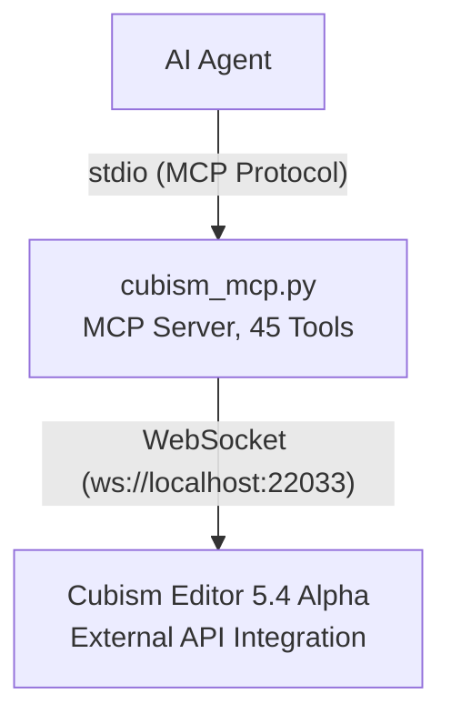

# Cubism External Edit MCP

[](https://www.live2d.com/cubism/download/editor/)
[](https://www.python.org/)
[](https://modelcontextprotocol.io/)
[](https://pypi.org/project/cubism-mcp/)

[](LICENSE)
[](https://github.com/nana7chi/CubismExternalEditMCP/stargazers)
[](https://github.com/nana7chi/CubismExternalEditMCP/commits)

[中文](../README.md) | English | [日本語](README_JA.md) | [한국어](README_KO.md)

Wrap the Live2D Cubism Editor External API as **MCP (Model Context Protocol)** tools, enabling AI Agents to control Cubism Editor through natural language.

> Official Reference: https://creatorsforum.live2d.com/t/topic/3938

## Architecture



## Features

- **Read/Write Operations** — Read/write model parameter values, view document list, get edit mode (compatible with Editor 4.x+)
- **Full Model Inspection** — Parameter structure, part structure, deformer structure, individual object details (requires 5.4 Alpha)
- **Edit Operations** — CRUD for parameters, parts, deformers, ArtMesh, and Glue, with automatic transaction wrapping (requires 5.4 Alpha)
- **Batch Editing** — Execute multiple operations within a single transaction; any failure triggers automatic rollback
- **Permission Levels** — Allow for read access, Edit for write access
- **Auto Reconnect** — Reconnects every 3 seconds after Editor restart
- **Token Persistence** — Authentication token cached in `~/.cubism-mcp/token.txt` to avoid repeated authorization

## Requirements

| Component | Version |
|-----------|---------|
| Python | ≥ 3.10 |
| Cubism Editor | 5.4 Alpha (expiration varies by build; consult the official information for your installed version) |
| OS | Windows / macOS |

## Usage

### Quick Start

**Copy and send the following prompt to your AI Agent**:

> According to https://github.com/nana7chi/CubismExternalEditMCP/blob/master/README.md, install and configure cubism-mcp for me. If `uv` is not installed on this computer, install it first. Let me know when it's ready.


### Step 1: Install uv (one-time only)

`uv` is a tiny Python package manager that auto-installs and runs this MCP. No manual Python environment management needed afterwards.

**macOS** (paste in terminal):
```bash
curl -LsSf https://astral.sh/uv/install.sh | sh
```

**Windows** (paste in PowerShell):
```powershell
powershell -ExecutionPolicy ByPass -c "irm https://astral.sh/uv/install.ps1 | iex"
```

After installation, **restart your terminal** and run `uv --version` to verify.

> Don't want to install uv? You can also use a local Python (≥3.10) with `pip install -r requirements.txt` then `python cubism_mcp.py`, but you'll manage dependencies yourself.

### Step 2: Configure MCP in your AI Agent

> Supports Claude Code, Codex, Workbuddy, OpenCode and other MCP-compatible clients.

> The first launch auto-downloads dependencies (~1–2 min); subsequent starts are instant.

#### Option 1: PyPI Install (Recommended)

```json
{
  "mcpServers": {
    "cubism-mcp": {
      "type": "stdio",
      "command": "uvx",
      "args": ["cubism-mcp"],
      "description": "Cubism Editor MCP",
      "env": { "NO_PROXY": "localhost,127.0.0.1" }
    }
  }
}
```

#### Chinese Mirror Config

If the official PyPI source is slow, use a Chinese mirror (Tsinghua/Alibaba/Tencent Cloud, etc.):

```json
{
  "mcpServers": {
    "cubism-mcp": {
      "type": "stdio",
      "command": "uvx",
      "args": ["--index-url", "https://pypi.tuna.tsinghua.edu.cn/simple", "cubism-mcp"],
      "description": "Cubism Editor MCP",
      "env": { "NO_PROXY": "localhost,127.0.0.1" }
    }
  }
}
```

> You can also use Alibaba `https://mirrors.aliyun.com/pypi/simple` or Tencent Cloud `https://mirrors.cloud.tencent.com/pypi/simple`.

#### Option 2: uvx One-Line (GitHub Source)

Add the following MCP configuration:

```json
{
  "mcpServers": {
    "cubism-mcp": {
      "type": "stdio",
      "command": "uvx",
      "args": ["--from", "git+https://github.com/nana7chi/CubismExternalEditMCP.git", "cubism-mcp"],
      "description": "Cubism Editor MCP",
      "env": { "NO_PROXY": "localhost,127.0.0.1" }
    }
  }
}
```

#### Option 3: Local Clone

1. Clone the repository (or download ZIP and extract):

```bash
git clone https://github.com/nana7chi/CubismExternalEditMCP.git
```

2. Add the following MCP configuration (change `cwd` to the actual path):

```json
{
  "mcpServers": {
    "cubism-mcp": {
      "type": "stdio",
      "command": "python",
      "args": ["cubism_mcp.py"],
      "cwd": "J:/change/to/your/actual/path/CubismExternalEditMCP",
      "description": "Cubism Editor MCP",
      "env": { "NO_PROXY": "localhost,127.0.0.1" }
    }
  }
}

### Step 3: Enable External Integration in Cubism Editor

1. Launch Cubism Editor 5.4 Alpha and open a model
2. Menu **File → External App Integration Settings**
3. Confirm port is `22033`, turn on the **Use** toggle
4. In the authorization dialog, find `cubism-mcp`, **check Allow and Edit**, click OK


> If you don't see the dialog, check the Editor's bottom-right corner for a blinking external app icon — click it to open the dialog.

### Step 4: Start Using

Control the Editor through natural language in your AI Agent, for example:

```
"List the parameter structure of the current model"
"Inspect the part hierarchy"
"Change the Eyebrow part label color to blue"
"Create parameter ParamsTest, ID ParamTest, range 0-1, default 0.5"
"Batch add 3 keyframes to ParamAngleX"
```

## Available Tools

### Diagnostics

| Tool | Description |
|------|------------|-------------|
| `cubism_status` | Check connection status, registration status, Allow/Edit authorization |

### Read/Write

| Tool | Parameters | Description |
|------|------------|-----------|-------------|
| `cubism_get_model_uid` | — | Get UID of the currently opened model |
| `cubism_get_documents` | — | List all open documents (modeling/physics/animation) |
| `cubism_get_document` | `document_uid` | Get details of a single document by UID |
| `cubism_get_current_edit_mode` | — | Get current edit mode (Physics/Modeling/Animation/…) |
| `cubism_get_parameter_values` | `model_uid`, `ids?` | Read current model parameter values |
| `cubism_set_parameter_values` | `model_uid`, `parameters[]` | Write parameter values (no edit transaction needed) |
| `cubism_clear_parameter_values` | `model_uid` | Clear temp buffer from SetParameterValues |
| `cubism_get_parameters` | `model_uid` | Parameter metadata (name/range/keyform/type) |
| `cubism_get_parameter_groups` | `model_uid` | Parameter group list |

### Structure Inspection (5.4 Alpha)

| Tool | Parameters | Description |
|------|------------|-----------|-------------|
| `cubism_get_parameter_structure` | `model_uid` | Full parameter structure tree (groups + params hierarchy) |
| `cubism_get_part_structure` | `model_uid` | Part structure tree (ArtMesh/Deformer/Part/Glue) |
| `cubism_get_deformer_structure` | `model_uid` | Deformer structure tree |
| `cubism_get_object` | `model_uid`, `id` | Get details of a specific object |
| `cubism_get_selected` | `model_uid` | Get currently selected objects in Editor |
| `cubism_get_parameter_keys` | `model_uid`, `object_id` | Get keyframe bindings of an object |
| `cubism_get_objects_by_parameter_keys` | `model_uid`, `parameter_id`, `key_value` | Reverse-lookup objects by parameter keyframes |

### Editing (5.4 Alpha)

| Tool | Parameters | Description |
|------|------------|-----------|-------------|
| `cubism_edit` | `action`, `params` | Execute a single edit operation (auto Begin/End) |
| `cubism_edit_batch` | `actions[]` | Batch edit (single transaction, auto rollback on failure) |
| `cubism_add_selected_objects` | `model_uid`, `ids[]` | Programmatically select objects (preserves existing selections) |
| `cubism_clear_selected_objects` | `model_uid` | Clear all selected states |

#### Supported Edit Actions

| Action | Key Parameters | Description | Prompt Example |
|--------|---------------|-------------|----------------|
| `AddParameter` | `GroupId`, `ParameterName`, `ParameterId`, `Default`, `Minimum`, `Maximum` | Add a parameter to a group | "Create parameter 'Test', ID ParamTest, range 0–1, default 0.5, in the 'Expression' group" |
| `EditParameter` | `Id`, `ParameterName`, `Default`, `Minimum`, `Maximum` | Edit parameter properties | "Change ParamTest max value to 2" |
| `DeleteParameter` | `Id` | Delete a parameter | "Delete the ParamTest parameter" |
| `AddParameterGroup` | `GroupName`, `GroupId`, `ParentGroupId` | Add a parameter group | "Create a new parameter group 'TestGroup'" |
| `EditParameterGroup` | `Id`, `GroupName`, `LabelColorType`, `LabelCustomColor` | Edit group properties | "Change the 'XYZ' group label color to blue" |
| `DeleteParameterGroup` | `Id` | Delete a parameter group | "Delete the 'TestGroup' parameter group" |
| `MoveParameter` | `Id`, `NewGroupId`, `InsertPosition` | Move parameter to a new position/group | "Move ParamTest to the top of the 'XYZ' group" |
| `MoveParameterGroup` | `Id`, `InsertPosition` | Reorder parameter groups | "Move the 'Eyebrow' group to first position" |
| `AddParameterKey` | `ParameterId`, `KeyValue` | Add a keyframe to a parameter | "Add a keyframe at 0.5 for ParamAngleX" |
| `DeleteParameterKey` | `ParameterId`, `KeyValue` | Delete a parameter keyframe | "Delete ParamAngleX keyframe at -30" |
| `MoveParameterKey` | `ParameterId`, `OldKeyValue`, `NewKeyValue` | Move a keyframe position | "Move ParamAngleX keyframe from 0.5 to 0.8" |
| `AddPart` | `Name`, `Id`, `ParentId` | Add a part | "Create part 'Pupil' under 'LeftEye'" |
| `EditPart` | `Id`, `Name`, `LabelColorType`, `LabelCustomColor`, `Opacity` | Edit part properties<br>⚠️ Use `LabelColorType`+`LabelCustomColor`, NOT `LabelColor` | "Set 'Eyebrow' part label color to blue" |
| `AddWarpDeformer` | `Name`, `Id`, `ParentId` | Add a warp deformer | "Create a warp deformer under 'FrontHair'" |
| `AddRotationDeformer` | `Name`, `Id`, `ParentId` | Add a rotation deformer | "Create a rotation deformer under 'Head'" |
| `EditWarpDeformer` | `Id`, `Name`, ... | Edit warp deformer properties | "Rename warp deformer 'Surface2' to 'Face'" |
| `EditRotationDeformer` | `Id`, `Name`, `Angle`, `Scale`, ... | Edit rotation deformer properties | "Change face rotation angle to 15 degrees" |
| `EditArtMesh` | `Id`, `Opacity`, ... | Edit ArtMesh properties | "Set ArtMesh 'LeftEye Highlight' opacity to 50%" |
| `EditGlue` | `Id`, ... | Edit glue properties | "Adjust glue object weight" |
| `DeleteObject` | `Id` | Delete an object from the parts palette | "Delete object with ID Warp999" |
| `MoveObjectOnPartsPalette` | `Id`, `NewParentId`, `InsertPosition` | Move object position in parts palette | "Move warp deformer 'Surface2' to position 0" |

## Native Bridge (optional)

The official External API Integration only covers a limited set of operations — for example, a rotation
deformer's pivot position can be read but not written. Install the optional `cubism_bridge.dll` component
to extend native editing capabilities:

After installing and restarting the Editor, this MCP server exposes:

| Tool | Description |
|------|-------------|
| `cubism_bridge_status` | Check whether the bridge is installed and connected |
| `cubism_bridge_ops` | List the native operations registered by the bridge |
| `cubism_bridge_invoke` | Invoke a native operation (whitelist enforced by the bridge registry) |

> Without the bridge these three tools return `BridgeNotInstalled` with setup steps; all other tools are unaffected.

**CubismBridge 0.7.0 registers 73 native operations; the MCP tool count remains 45**. Existing capabilities include geometry editing, physics, image export, document saving, workspace / palette / tool / canvas state, layered PSD, CMOX, SDK2/SDK3 model data, texture atlas creation, animation tracks / parameter keyframes / form animation, and video export. Additions and limitations for 0.5.0–0.7.0 are described below.

- Physics imports and global edits support native undo / redo. CMO3 preserves settings groups and FPS; use physics3 JSON to preserve gravity and wind.
- Animation supports four native targets and CAN3 save / reopen. `editor.document.save` accepts `path`, which is required for untitled documents. Model / animation write failures return errors without retry dialogs.
- Layered PSD supports original sources and the current pose. CMOX and SDK2/SDK3 exports produce actual model assets. Texture atlas creation supports undo / redo and save / reopen; it uses the native initial layout, not optimized packing.
- Animation supports model tracks, persistent explicit track names, numeric parameter keyframes and interpolation, frame / scene settings, and form animation entry. MOV/MP4/WebM encoding and decoding have been verified; audio tracks are not supported. Export preserves the existing scene layout and does not automatically center the model.
- Fixed native operations cover workspace switching, palette visibility, tool switching, and canvas / timeline settings. Failure isolation and mode protection do not imply every palette field is writable.
- `editor.command.invoke` supports typed arguments and automatic `IDocument` injection. Suspected dialog commands are rejected unless `allowDialog=true`; destructive commands such as delete / exit additionally require `confirm=true`. Manual menu operations are unchanged.
- `cubism_bridge_invoke` waits up to 190 seconds for a native result, covering the bridge's longest 180-second operation limit. Startup and status probes retain their shorter waits. Restart the MCP service after updating the Python adapter.
- A disconnect or response timeout after sending a request returns `BridgeOutcomeUnknown` without replaying it on another port. The operation may have completed or still be running; inspect Editor state before deciding whether to retry.
- Native responses are bounded at 64 MiB, supporting results larger than 64 KiB such as per-frame physics output. Oversized or unparseable responses also return `BridgeOutcomeUnknown` without replay. Inspect actual state; a transport failure does not mean the operation was not executed.
- Visibility, hierarchy selection and Solo have scoped behavioral verification. `command_loadVisibleMap` swaps two visibility snapshots without adding an undo entry. `command_solo` fixes its targets at activation and clears temporary locks on exit. An empty snapshot or selection can trigger native warnings; static command classification does not guarantee dialog-free execution for every input.

Query `cubism_bridge_ops` for the operation list. **Registration does not establish full native coverage**. There is scoped behavioral evidence for 150 native command names, not every input to those commands or the whole Editor; dedicated operations are not counted as additional verified menu commands. All four Solo color / opacity combinations have been verified on the actual canvas; ordinary model export does not include this view isolation. Closing and reopening the model resets Solo and its options.

### Additions and limitations in 0.5.0–0.7.0

All operations below use `op` / `args` through `cubism_bridge_invoke`; no additional MCP tool names are needed. Consult `cubism_bridge_ops` for the version actually loaded.

| Operation | Usage and limits |
|-----------|------------------|
| `editor.export.moc` | `path` targets a `.moc3`; its parent directory must exist and the model needs atlas bindings. Exports MOC only, not PNG/JSON. Optional `mocVersion` / `pixelsPerUnit`; default PPU comes from model export settings or native defaults, not the old MOC. |
| `editor.export.modeldata.update` | `path` is an existing runtime package directory; `include` must be explicit and nonempty. Use `["moc"]` for MOC only. Allowed categories: `moc/textures/physics/userdata/displayInfo/motionsync/paramctrl/model3`, not `all`. Unrelated files are not deleted. |
| `editor.physics.step` | Copies parameter and physics state for isolated simulation, leaving the active model and undo history unchanged. `inputs` maps parameter IDs to fixed values; `frames` is 1–10000; `fps` / `dt` are mutually exclusive. Calls are independent, even with `reset=false`. Currently reports `gravityApplied=false`; the final frame delta does not guarantee convergence for arbitrary inputs. |
| `editor.psd.layers` / `editor.psd.import` | Query source GUIDs and replacement eligibility first, then import 8-bit PSD with `path` and `mode`: `newModel` / `addImage` / `addArtMeshes` / `replace`. Replacement requires `target`. New meshes are not automatically bound to existing deformers. Replacement preserves existing geometry / bindings / parameter keyforms, but new layers and size changes still require texture and binding checks. |
| `editor.mesh.generate` | Supply one ArtMesh `id` and integer `outerDensity` / `innerDensity` (10–200; smaller means denser). Rebuilds topology and remaps all keyforms, not an exact target vertex count. Normal modeling mode only; locked objects and Glue participants are rejected. |
| `editor.canvas.guides.get` / `editor.canvas.guides.set` | Guides use model canvas pixels, top-left origin, Y down. `horizontal` / `vertical` arrays replace that entire axis; omit to preserve, use `[]` to clear, and specify at least one axis. Display / snapping preferences are unchanged. Supports native undo / redo. |
| `editor.resources.references` / `editor.resources.remove` | Query all resource references by native GUID, including inactive texture inputs, and inspect `deletable`. Safe deletion is limited to unreferenced replaced PSD sources or atlases; no automatic cleanup. |
| `editor.textureAtlas.get` / `editor.textureAtlas.update` | Read or refresh / rename / resize / re-layout an existing atlas by native `guid`. Preserves GUID, order and membership; no atlas merging, member addition / removal, or migration of references from other atlases. Short examples follow. |

- Runtime package updates regenerate explicitly selected JSON and may discard custom fields; select `model3` only when intentionally rewriting the entry file. Check `updated` / `skipped` / warnings and PPU. Optional `backupDir` must already exist and not overlap the target; existing backups are not overwritten and symlink/junction paths are rejected. Recoverable failures trigger restoration attempts, but there is no multi-file reader isolation or power-loss recovery guarantee. If restoration is incomplete, stop writing and recover the package before proceeding; do not blindly retry.
- Fixes include texture-wrapper / UV restoration during MOC export after reopening a model, and deletion with parameter transfer through bridge `command_deleteDeformerAndSetParam`. This does not cover arbitrary Morph / interpolation combinations; unsupported cases are explicitly rejected. The global native mesh menu UV / dirty issue is not fixed.
- The 0.6.0 multi-scene close fix covers **bridge-initiated closing only**, returning `closed` / `cancelled`; cancellation may also reflect a save failure. Save before closing; a timeout is not proof of closure and must not trigger automatic replay. `command_closeAll` is non-atomic and may close other files after one is cancelled. Manual menus, exit and other native close entry points are outside this fix.

### Short examples: atlas updates and safe resource deletion

Save the model first and use normal modeling mode. Each JSON object below is one `cubism_bridge_invoke` argument object. Replace placeholder GUIDs with values queried from the current model; names and array indices are not resource identifiers.

```json
{"op":"editor.resources.references","args":{}}
```

```json
{"op":"editor.textureAtlas.get","args":{"guid":"<ATLAS_GUID>"}}
```

`get` returns dimensions, lock state and `images`. The default `layout:"keep"` preserves layout, but `update` **still refreshes the pixel cache and creates an undo transaction**. Optional `name` / `width` / `height` retain their old values when omitted; dimensions must be powers of two from 32 to 16384.

```json
{"op":"editor.textureAtlas.update","args":{"guid":"<ATLAS_GUID>","layout":"keep"}}
```

Use the following for native grid re-layout when appropriate. 4096 is only an example size, not suitable for every model. `grid` may shrink images; it is neither optimal packing nor a lossless-resolution guarantee. `autoLayoutLock` or insufficient cell padding causes rejection.

```json
{"op":"editor.textureAtlas.update","args":{"guid":"<ATLAS_GUID>","width":4096,"height":4096,"layout":"grid"}}
```

- For explicit layout, use `placements:[{"modelImageGuid":"<IMAGE_GUID>","matrix":[m00,m10,m01,m11,m02,m12]}]`. Obtain the GUID from `get` → `images[].imageGuid`, start with that member's `modelImageToAtlas`, and change only the required components. The six coefficients map image-local pixels to atlas pixels, not normalized UVs. Matrices must be finite and invertible; only existing members can be changed, and `placements` cannot be combined with `grid`.
- New layout / binding matrices are committed at native float32 precision. Use the returned `storagePrecision` and actual `after`, not the requested double values, as final state. Unchanged matrices under `keep` remain untouched. Callers must prevent cropping and overlap; successful execution does not establish layout quality.
- Independently locked caches, ArtPath brush references or ambiguous re-layout input associations are rejected. Real re-layout must change the relevant UVs; check sampling correspondence rather than forcing old UVs to remain. Scoped atlas verification covered exact undo / redo, undo across a subsequent creation, commit-failure and history recovery, and source / layout / RGBA persistence in a new JVM. Real Core checks covered geometry, texture indices and UV correspondence for 45 drawables; this is not a claim of new SDK viewer screenshot verification.
- After writing, query `get` / `references` again and check target and non-target resources, the Editor canvas, actual MOC/PNG sampling and save / reopen. Even an ordinary successful undo that exactly restores data may leave native `dirty=true`; inspect the data and save explicitly, rather than undoing repeatedly or manually clearing dirty. This differs from commit-failure recovery. Stop writing on an unknown outcome or incomplete recovery; never blindly replay.

Before deletion, **query `editor.resources.references` again**. Only for a resource currently marked `deletable:true`, use `kind:"psdSource"` or `kind:"textureAtlas"` with its `guid` and `confirm:true`:

```json
{"op":"editor.resources.remove","args":{"kind":"psdSource","guid":"<DELETABLE_SOURCE_GUID>","confirm":true}}
```

Active sources and any referenced resources, including old atlases referenced by inactive inputs, are rejected. There is no safe-delete operation for model images. Deletion supports native undo / redo; recheck references and save afterward. Atlas updates do not perform cleanup for you.

### Download and install (Releases of this fork)

The bridge is distributed as **standalone DLL binary assets** without modifying `Live2D_Cubism.jar`; this update does not publish a PyPI package. Before upgrading to 0.7.0, confirm that `bridge-v0.7.0` and the assets below are actually available in Releases. This section does not establish that publication or your local upgrade has completed:
<https://github.com/MurasameCyan/CubismExternalEditMCP/releases>

| Asset | Description |
|-------|-------------|
| `cubism_bridge.dll` | Bridge payload (agent embedded; put it in `%LocalAppData%\CubismPatch\` or the editor's `app\jre\bin\`) |
| `jli_generic.dll` | Generic jli proxy: install as the editor's `app\jre\bin\jli.dll`; it loads the bridge |
| `install.bat` / `uninstall.bat` | Install / uninstall; usage: `install.bat "<Live2D Cubism install dir>"` |
| `SHA256SUMS.txt` | SHA-256 checksums |

Install / upgrade:

1. Save your work and exit the Editor. Download the listed assets from the same version and verify them against `SHA256SUMS.txt`.
2. **Generic jli proxy channel**: run `install.bat "<Live2D Cubism install dir>"`. The editor's `app\jre\bin\cubism_bridge.dll` takes precedence over the user-directory copy; updating only the lower-priority copy does not update the loaded version.
3. Restart the MCP service after updating the Python adapter, and restart the Editor. Call `cubism_bridge_status`, invoke `{"op":"bridge.ping","args":{}}` through `cubism_bridge_invoke`, and use `cubism_bridge_ops` to confirm the loaded version is 0.7.0 with 73 registered operations. A downloaded filename alone does not prove a successful upgrade.

> The bridge binaries target Cubism Editor 5.4.00 alpha2 on Windows; a major editor update may require a new bridge release.

## Troubleshooting

| Symptom | Cause | Solution |
|---------|-------|----------|
| MCP status red | Wrong Python path, missing dependencies, or incorrect `cwd` | Verify Python ≥ 3.10, dependencies installed, and `cwd` path |
| Not connected to Editor | Editor not running or external integration not enabled | Launch Editor → open model → enable external integration |
| Not approved | Allow not checked in dialog | Check Allow in external integration dialog |
| Edit errors | Edit not checked in dialog | Check Edit in external integration dialog |
| Broken after restart | Editor restart requires re-authorization | Re-enable external integration and re-check permissions |
| Operation errors | Incorrect parameter names or IDs | Run `cubism_get_*_structure` first to inspect the model |

## Development

```bash
# Run directly for testing
python cubism_mcp.py

# Install dependencies
pip install -r requirements.txt
```

### Dependencies

| Package | Purpose |
|---------|---------|
| `mcp` | MCP server framework (FastMCP + stdio communication) |
| `websockets` | WebSocket client for Editor API connection |

## Notes

- **Alpha Limitations**: Expiration varies by Alpha build; consult the official information for your installed version and upgrade when it expires
- **Restart Re-auth**: Re-enable external integration and re-check permissions after each Editor restart
- **Single Model**: The MCP server operates on one open model at a time
- **Transaction Safety**: Edit operations are automatically wrapped with `EditBegin/EditEnd`; batch operations auto `Cancel` and rollback on failure

## License

MIT
