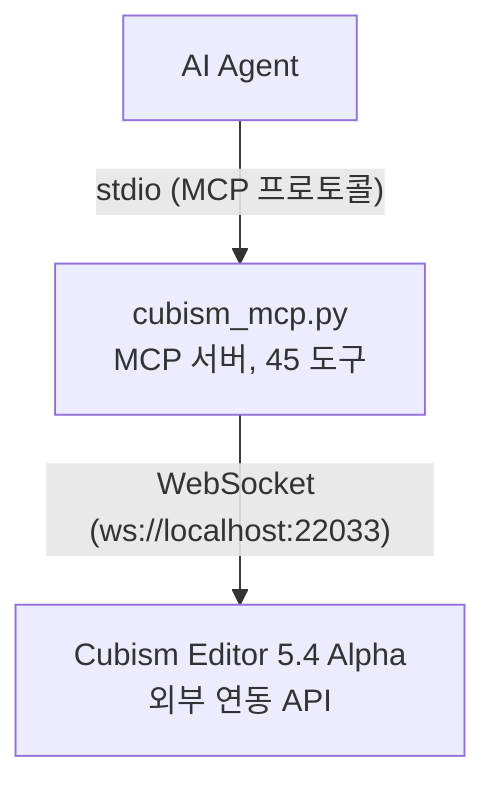

# Cubism External Edit MCP

[](https://www.live2d.com/cubism/download/editor/)
[](https://www.python.org/)
[](https://modelcontextprotocol.io/)
[](https://pypi.org/project/cubism-mcp/)

[](LICENSE)
[](https://github.com/nana7chi/CubismExternalEditMCP/stargazers)
[](https://github.com/nana7chi/CubismExternalEditMCP/commits)

[中文](../README.md) | [English](README_EN.md) | [日本語](README_JA.md) | 한국어

Live2D Cubism Editor의 외부 연동 API를 **MCP (Model Context Protocol)** 도구로 래핑하여, AI Agent가 자연어로 Cubism Editor를 조작할 수 있도록 합니다.

> 공식 레퍼런스: https://creatorsforum.live2d.com/t/topic/3938

## 아키텍처



## 기능

- **읽기/쓰기 작업** — 모델 파라미터 값 읽기/쓰기, 문서 목록 확인, 편집 모드 가져오기 (Editor 4.x 이상 호환)
- **완전한 모델 검사** — 파라미터 구조, 파트 구조, 디포머 구조, 개별 오브젝트 상세 (5.4 Alpha 필요)
- **편집 작업** — 파라미터/파트/디포머/아트메시/글루의 추가·편집·삭제, 자동 트랜잭션 처리 (5.4 Alpha 필요)
- **배치 편집** — 단일 트랜잭션으로 여러 작업 실행, 실패 시 자동 롤백
- **권한 단계** — 조회는 「허용」, 편집은 「편집」 승인�� 필요
- **자동 재접속** — Editor 재시작 후 3초 간격으로 자동 재접속
- **토큰 유지** — 인증 토큰을 `~/.cubism-mcp/token.txt`에 캐시하여 재인증 방지

## 요구 사항

| 구성 요소 | 버전 |
|-----------|------|
| Python | ≥ 3.10 |
| Cubism Editor | 5.4 Alpha (유효 기간은 빌드에 따라 다릅니다. 설치한 버전의 공식 안내를 확인하세요) |
| OS | Windows / macOS |

## 사용 방법

### 빠른 시작

**아래 프롬프트를 복사하여 AI Agent에 보내세요**:

> https://github.com/nana7chi/CubismExternalEditMCP/blob/master/README.md에 따라 cubism-mcp를 설치 및 설정해 주세요. 이 컴퓨터에 `uv`가 설치되어 있지 않다면 먼저 설치해 주세요. 준비가 완료되면 알려주세요.


### 1단계: uv 설치 (최초 1회)

`uv`는 경량 Python 패키지 관리자로, 본 MCP의 자동 설치 및 실행에 사용됩니다. 설치 후에는 Python 환경 관리가 필요하지 않습니다.

**macOS** (터미널에 붙여넣기):
```bash
curl -LsSf https://astral.sh/uv/install.sh | sh
```

**Windows** (PowerShell에 붙여넣기):
```powershell
powershell -ExecutionPolicy ByPass -c "irm https://astral.sh/uv/install.ps1 | iex"
```

설치 완료 후 **터미널을 재시작**하고 `uv --version`으로 버전이 표시되면 성공입니다.

> uv를 설치하고 싶지 않은 경우: Python(≥3.10)을 로컬에 준비하고, `pip install -r requirements.txt`로 종속 패키지를 설치한 후 `python cubism_mcp.py`로 실행할 수도 있습니다. 단, 종속성은 직접 관리해야 합니다.

### 2단계: AI Agent에 MCP 설정

> `ClaudeCode`, `Codex`, `Workbuddy` 등 다양한 MCP 호환 클라이언트에서 동작합니다.

> 최초 실행 시 종속 패키지 자동 다운로드에 약 1~2분 소요됩니다. 이후에는 즉시 시작됩니다.

#### 방법 1: PyPI 설치 (권장)

```json
{
  "mcpServers": {
    "cubism-mcp": {
      "type": "stdio",
      "command": "uvx",
      "args": ["cubism-mcp"],
      "description": "Cubism Editor MCP",
      "env": { "NO_PROXY": "localhost,127.0.0.1" }
    }
  }
}
```

#### 중국 미러 설정

PyPI 공식 소스가 느린 경우 중국 미러(칭화대/Alibaba/Tencent Cloud 등)를 사용하세요:

```json
{
  "mcpServers": {
    "cubism-mcp": {
      "type": "stdio",
      "command": "uvx",
      "args": ["--index-url", "https://pypi.tuna.tsinghua.edu.cn/simple", "cubism-mcp"],
      "description": "Cubism Editor MCP",
      "env": { "NO_PROXY": "localhost,127.0.0.1" }
    }
  }
}
```

> Alibaba `https://mirrors.aliyun.com/pypi/simple` 또는 Tencent Cloud `https://mirrors.cloud.tencent.com/pypi/simple`로도 변경 가능합니다.

#### 방법 2: uvx 온라인 실행 (GitHub 소스)

다음 MCP 설정 추가:

```json
{
  "mcpServers": {
    "cubism-mcp": {
      "type": "stdio",
      "command": "uvx",
      "args": ["--from", "git+https://github.com/nana7chi/CubismExternalEditMCP.git", "cubism-mcp"],
      "description": "Cubism Editor MCP",
      "env": { "NO_PROXY": "localhost,127.0.0.1" }
    }
  }
}
```

#### 방법 3: 로컬 클론 실행

1. 소스 코드 클론 (또는 ZIP 다운로드 후 압축 해제)

```bash
git clone https://github.com/nana7chi/CubismExternalEditMCP.git
```

2. 다음 MCP 설정 추가 (`cwd`를 실제 경로로 변경):

```json
{
  "mcpServers": {
    "cubism-mcp": {
      "type": "stdio",
      "command": "python",
      "args": ["cubism_mcp.py"],
      "cwd": "J:/실제 경로로 변경/CubismExternalEditMCP",
      "description": "Cubism Editor MCP",
      "env": { "NO_PROXY": "localhost,127.0.0.1" }
    }
  }
}
```

### 3단계: Cubism Editor에서 외부 연동 활성화

1. Cubism Editor 5.4 Alpha를 실행하고 모델 열기
2. 메뉴 「**파일**」→「**외부 애플리케이션 연동 설정**」
3. 포트가 `22033`인지 확인하고 「**사용**」 토글 켜기
4. 인증 대화 상자가 표시되면 `cubism-mcp`를 찾아 **「허용」과 「편집」에 체크**하고 OK 클릭

> 대화 상자가 표시되지 않으면 Editor 오른쪽 하단의 깜박이는 외부 앱 아이콘을 확인하세요. 클릭하면 대화 상자가 열립니다.


### 4단계: 사용 시작

AI Agent에서 자연어로 Editor를 조작합니다. 예:

```
"현재 모델의 파라미터 구조 나열"
"파트 계층 확인"
"눈썹 파트의 라벨 색상을 파란색으로 변경"
"파라미터 ParamsTest, ID ParamTest, 범위 0-1, 기본값 0.5 생성"
"ParamAngleX에 키폼 3개 일괄 추가"
```

## 사용 가능한 도구

### 진단

| 도구 | API 버전 | 설명 |
|------|---------|------|
| `cubism_status` | 접속 상태, 등록 상태, 허용/편집 인증 확인 |

### 읽기/쓰기

| 도구 | API 버전 | 파라미터 | 설명 |
|------|---------|---------|------|
| `cubism_get_model_uid` | — | 현재 열려 있는 모델의 UID 가져오기 |
| `cubism_get_documents` | — | 열린 모든 문서 나열 (모델링/물리/애니메이션) |
| `cubism_get_document` | `document_uid` | UID로 단일 문서 상세 가져오기 |
| `cubism_get_current_edit_mode` | — | 현재 편집 모드 가져오기 (Physics/Modeling/Animation/…) |
| `cubism_get_parameter_values` | `model_uid`, `ids?` | 모델 파라미터 현재값 읽기 |
| `cubism_set_parameter_values` | `model_uid`, `parameters[]` | 파라미터 값 쓰기 (편집 트랜잭션 불필요) |
| `cubism_clear_parameter_values` | `model_uid` | SetParameterValues 임시 버퍼 초기화 |
| `cubism_get_parameters` | `model_uid` | 파라미터 메타 정보 (이름/범위/키폼/타입) |
| `cubism_get_parameter_groups` | `model_uid` | 파라미터 그룹 목록 |

### 구조 검사 (5.4 Alpha 신규)

| 도구 | API 버전 | 파라미터 | 설명 |
|------|---------|---------|------|
| `cubism_get_parameter_structure` | `model_uid` | 완전한 파라미터 구조 트리 (그룹+파라미터 계층) |
| `cubism_get_part_structure` | `model_uid` | 파트 구조 트리 (아트메시/디포머/파트/글루) |
| `cubism_get_deformer_structure` | `model_uid` | 디포머 구조 트리 |
| `cubism_get_object` | `model_uid`, `id` | 지정된 오브젝트 상세 가져오기 |
| `cubism_get_selected` | `model_uid` | Editor에서 현재 선택된 오브젝트 목록 |
| `cubism_get_parameter_keys` | `model_uid`, `object_id` | 오브젝트의 키폼 바인딩 가져오기 |
| `cubism_get_objects_by_parameter_keys` | `model_uid`, `parameter_id`, `key_value` | 파라미터 키폼으로 연결된 오브젝트 역조회 |

### 편집 (5.4 Alpha 신규)

| 도구 | API 버전 | 파라미터 | 설명 |
|------|---------|---------|------|
| `cubism_edit` | `action`, `params` | 단일 편집 작업 실행 (EditBegin/EditEnd 자동 처리) |
| `cubism_edit_batch` | `actions[]` | 배치 편집 (동일 트랜잭션, 실패 시 자동 롤백) |
| `cubism_add_selected_objects` | `model_uid`, `ids[]` | 프로그래밍 방식으로 오브젝트 선택 (기존 선택 유지) |
| `cubism_clear_selected_objects` | `model_uid` | 모든 선택 상태 해제 |

#### 지원되는 편집 Action

| Action | 주요 파라미터 | 설명 | 프롬프트 예시 |
|--------|-------------|------|-------------|
| `AddParameter` | `GroupId`, `ParameterName`, `ParameterId`, `Default`, `Minimum`, `Maximum` | 지정 그룹에 파라미터 추가 | 「파라미터 '테스트', ID ParamTest, 범위 0~1, 기본값 0.5, '표정 전환' 그룹에 생성」 |
| `EditParameter` | `Id`, `ParameterName`, `Default`, `Minimum`, `Maximum` | 파라미터 속성 편집 | 「ParamTest의 최대값을 2로 변경」 |
| `DeleteParameter` | `Id` | 파라미터 삭제 | 「ParamTest 파라미터 삭제」 |
| `AddParameterGroup` | `GroupName`, `GroupId`, `ParentGroupId` | 파라미터 그룹 추가 | 「파라미터 그룹 '테스트 그룹' 생성」 |
| `EditParameterGroup` | `Id`, `GroupName`, `LabelColorType`, `LabelCustomColor` | 그룹 속성 편집 | 「'XYZ' 그룹의 라벨 색상을 파란색으로 변경」 |
| `DeleteParameterGroup` | `Id` | 파라미터 그룹 삭제 | 「'테스트 그룹' 파라미터 그룹 삭제」 |
| `MoveParameter` | `Id`, `NewGroupId`, `InsertPosition` | 파라미터를 새 위치/그룹으로 이동 | 「ParamTest를 'XYZ' 그룹의 맨 앞으로 이동」 |
| `MoveParameterGroup` | `Id`, `InsertPosition` | 파라미터 그룹 순서 변경 | 「'눈썹' 그룹을 첫 번째로 이동」 |
| `AddParameterKey` | `ParameterId`, `KeyValue` | 파라미터에 키폼 추가 | 「ParamAngleX의 0.5 위치에 키폼 추가」 |
| `DeleteParameterKey` | `ParameterId`, `KeyValue` | 파라미터 키폼 삭제 | 「ParamAngleX의 -30에 있는 키폼 삭제」 |
| `MoveParameterKey` | `ParameterId`, `OldKeyValue`, `NewKeyValue` | 키폼 위치 이동 | 「ParamAngleX의 0.5 키폼을 0.8로 이동」 |
| `AddPart` | `Name`, `Id`, `ParentId` | 파트 추가 | 「'왼쪽 눈' 아래에 파트 '동공' 생성」 |
| `EditPart` | `Id`, `Name`, `LabelColorType`, `LabelCustomColor`, `Opacity` | 파트 속성 편집<br>⚠️ 라벨 색상은 `LabelColorType`+`LabelCustomColor` 사용. `LabelColor`가 아닙니다 | 「'눈썹' 파트의 라벨 색상을 파란색으로 변경」 |
| `AddWarpDeformer` | `Name`, `Id`, `ParentId` | 워프 디포머 추가 | 「'앞머리' 아래에 워프 디포머 생성」 |
| `AddRotationDeformer` | `Name`, `Id`, `ParentId` | 회전 디포머 추가 | 「'머리' 아래에 회전 디포머 생성」 |
| `EditWarpDeformer` | `Id`, `Name`, ... | 워프 디포머 속성 편집 | 「워프 디포머 '곡면2'의 이름을 '얼굴'로 변경」 |
| `EditRotationDeformer` | `Id`, `Name`, `Angle`, `Scale`, ... | 회전 디포머 속성 편집 | 「얼굴 회전 각도를 15도로 변경」 |
| `EditArtMesh` | `Id`, `Opacity`, ... | 아트메시 속성 편집 | 「아트메시 '왼쪽 눈 하이라이트'의 불투명도�� 50%로 변경」 |
| `EditGlue` | `Id`, ... | 글루 속성 편집 | 「글루 오브젝트의 웨이트 조정」 |
| `DeleteObject` | `Id` | 파트 팔레트에서 오브젝트 삭제 | 「ID Warp999 오브젝트 삭제」 |
| `MoveObjectOnPartsPalette` | `Id`, `NewParentId`, `InsertPosition` | 파트 팔레트에서 오브젝트 위치 이동 | 「워프 디포머 '곡면2'를 위치 0으로 이동」 |

## 네이티브 브리지 (선택 사항)

공식 외부 연동 API는 제한된 작업만 제공합니다(예: 회전 디포머의 피벗 위치는 읽기만 가능).
네이티브 편집 기능을 확장하려면 선택적 브리지 구성 요소 `cubism_bridge.dll`을 설치하세요.

설치 후 Editor를 재시작하면 다음 도구가 추가됩니다:

| 도구 | 설명 |
|------|------|
| `cubism_bridge_status` | 브리지 설치 및 연결 상태 확인 |
| `cubism_bridge_ops` | 브리지에 등록된 네이티브 작업 목록 |
| `cubism_bridge_invoke` | 지정한 네이티브 작업 실행(화이트리스트는 브리지 레지스트리에서 관리) |

> 브리지가 없으면 이 세 도구는 `BridgeNotInstalled`와 설치 안내를 반환하며, 다른 도구에는 영향이 없습니다.

**CubismBridge 0.7.0은 네이티브 작업 73개를 등록**합니다. MCP 도구 수는 45개로 유지됩니다. 형상 편집, 물리, 이미지 내보내기와 문서 저장 외에 작업 공간 / 팔레트 / 도구 / 캔버스 상태, 레이어 PSD, CMOX, SDK2/SDK3 모델 데이터, 텍스처 아틀라스 생성, 애니메이션 트랙 / 파라미터 키프레임 / 폼 애니메이션, 비디오 내보내기를 지원합니다.

- 물리 가져오기와 전역 설정 변경은 네이티브 실행 취소 / 다시 실행을 지원합니다. CMO3는 설정 그룹과 FPS를 저장하며, 중력과 바람은 physics3 JSON으로 저장해야 합니다.
- 네 가지 네이티브 대상과 CAN3 저장 / 다시 열기를 지원합니다. `editor.document.save`의 `path`는 이름 없는 문서에서 필수입니다. 모델 / 애니메이션 쓰기 실패는 재시도 대화상자 없이 오류를 반환합니다.
- 레이어 PSD는 원본 소재와 현재 포즈를 지원하며, CMOX 및 SDK2/SDK3 내보내기는 실제 모델 자산을 생성합니다. 텍스처 아틀라스 생성은 실행 취소 / 다시 실행과 저장 / 다시 열기를 지원하지만, 최적화 배치가 아닌 네이티브 초기 배치를 사용합니다.
- 모델 트랙, 명시적 트랙 이름 저장, 숫자 파라미터 키프레임과 보간, 프레임 / 장면 설정, 폼 애니메이션 진입을 지원합니다. MOV/MP4/WebM 인코딩과 디코딩을 검증했으며 오디오 트랙은 현재 지원하지 않습니다. 기존 장면 배치를 유지하며 모델을 자동으로 가운데로 이동하지 않습니다.
- 작업 공간 전환, 팔레트 표시, 도구 전환, 캔버스 / 타임라인 설정에 고정된 네이티브 작업을 제공합니다. 실패 격리와 모드 보호가 모든 팔레트 필드의 쓰기 지원을 뜻하지는 않습니다.
- `editor.command.invoke`는 타입 지정 인자와 `IDocument` 자동 주입을 지원합니다. 대화상자를 열 수 있는 명령은 명시적인 `allowDialog=true`, 삭제 / 종료 등 파괴적 명령은 추가로 `confirm=true`가 필요합니다. 수동 메뉴 작업은 변경하지 않습니다.
- 0.5–0.7에서는 `editor.export.moc`, 명시적인 `include`가 필요한 `editor.export.modeldata.update`, `editor.psd.layers` / `editor.psd.import`(`newModel` / `addImage` / `addArtMeshes` / `replace`), `editor.mesh.generate`, `editor.canvas.guides.get` / `editor.canvas.guides.set`이 추가되었습니다. 메시 생성은 밀도를 명시해야 하며 전체 토폴로지와 모든 키폼을 변경합니다.
- `editor.physics.step`은 호출마다 독립적인 시뮬레이션을 수행하고 `gravityApplied=false`를 반환합니다. 연속 호출 사이의 상태 유지나 임의 조건에서의 수렴을 보장하지 않습니다. 중력과 바람은 CMO3에 저장되지 않으므로 physics3 JSON이 필요합니다.
- `editor.textureAtlas.get` / `editor.textureAtlas.update`는 네이티브 `guid`로 기존 아틀라스를 지정합니다. 업데이트는 기존 멤버를 유지하면서 새로 고침, 이름 / 크기 변경, `keep` / `grid` / `placements` 재배치를 지원합니다. 각 placement의 `modelImageGuid`와 `matrix: [m00,m10,m01,m11,m02,m12]`는 이미지 로컬 픽셀 좌표를 아틀라스 픽셀 좌표로 변환합니다. 아틀라스 간 이동 / 병합, 멤버 추가 / 삭제, 최적 패킹은 지원하지 않습니다. `grid`는 이미지 크기를 조정할 수 있으며 겹침이나 잘림은 호출 측에서 방지해야 합니다.
- 새 배치 / 바인딩 행렬은 커밋 전에 네이티브 float32 정밀도로 정규화됩니다. 응답의 `storagePrecision`과 실제 `after`를 확인하세요. 정확한 실행 취소 / 다시 실행, 생성 작업을 사이에 둔 실행 취소, 실패 시 데이터 / 이력 복구, 별도 JVM에서 원본 데이터 / 배치 / RGBA 다시 열기를 검증했습니다. 실제 Core의 drawable 45개에서 형상, 텍스처 인덱스 및 UV 대응을 확인했으나 새로운 SDK 뷰어 스크린샷 검증을 의미하지는 않습니다.
- `editor.resources.references`는 비활성 입력도 포함하여 참조를 조회합니다. `editor.resources.remove`는 삭제 가능으로 판정된 `kind: "psdSource"` 또는 `kind: "textureAtlas"`에만 `guid`와 `confirm=true`를 지정하여 실행합니다. 활성 또는 참조 중인 리소스는 거부하며 자동 정리는 하지 않습니다. 삭제 직전에 참조 상태를 다시 확인하세요.
- 다시 연 문서의 MOC 내보내기에서 텍스처 래퍼 / UV 복원과 파라미터 이전을 동반한 삭제를 수정했습니다. 0.6.0의 다중 장면 닫기 수정은 브리지 경로에만 적용되며 `closed` / `cancelled`를 반환합니다. 먼저 저장하세요. 수동 작업을 포함한 모든 종료 경로나 네이티브 전반의 메시 UV / dirty 문제를 해결한 것은 아닙니다.
- 일반 실행 취소가 성공하여 데이터가 정확히 복원되어도 네이티브 `dirty=true`가 남을 수 있습니다. 명시적으로 저장하고 dirty를 수동으로 해제하지 마세요. 이는 실패 시 복구와 별개의 동작입니다.
- `cubism_bridge_invoke`는 네이티브 작업의 최대 180초 제한을 포함하여 결과를 최대 190초 기다립니다. 응답 크기는 **64 MiB**로 제한됩니다. 시작 및 상태 확인은 기존의 짧은 대기 시간을 유지합니다. Python 어댑터 업데이트 후 MCP 서비스를 다시 시작하세요.
- 전송 후 연결 끊김, 시간 초과, 응답 크기 초과 또는 응답 파싱 오류가 발생하면 `BridgeOutcomeUnknown`을 반환하며 자동 재전송하지 않습니다(다른 포트로도 재전송하지 않습니다). 작업이 이미 완료되었거나 실행 중일 수 있으므로 다시 실행하기 전에 Editor 상태를 확인하세요.
- 표시 상태, 계층 선택 및 Solo의 한정된 동작 시나리오를 검증했습니다. `command_loadVisibleMap`은 두 표시 상태를 교환하며 실행 취소 항목을 추가하지 않습니다. `command_solo`는 활성화 시 대상을 고정하고 종료 시 임시 잠금을 해제합니다. 빈 스냅샷이나 빈 선택은 네이티브 경고를 표시할 수 있으며, 정적 명령 분류는 모든 입력에서 대화상자가 없음을 보장하지 않습니다.

작업 목록은 `cubism_bridge_ops`로 확인하세요. **등록되었다고 해서 모든 네이티브 작업의 검증이 끝난 것은 아닙니다**. 네이티브 명령 이름 150개에 한정된 시나리오의 동작 증거가 있으며 모든 입력과 경로를 포괄하지 않습니다. 전용 브리지 작업 추가는 명령 검증 수에 포함하지 않습니다. Solo 색상 / 불투명도 네 조합은 실제 캔버스에서 검증했으며 일반 모델 내보내기에는 이 뷰 격리 효과가 포함되지 않습니다. 모델을 닫고 다시 열면 Solo와 해당 옵션이 초기화됩니다. Editor 전체 지원을 의미하지 않습니다.

### 다운로드 및 설치(이 fork의 Releases)

브리지는 Releases에서 **바이너리만** 배포하며 `Live2D_Cubism.jar`를 수정하지 않습니다. 0.7.0의 대상 태그는 `bridge-v0.7.0`입니다. 공개 여부와 자산은 아래에서 확인하세요(PyPI 릴리스가 아닙니다):
<https://github.com/MurasameCyan/CubismExternalEditMCP/releases>

| 자산 | 설명 |
|------|------|
| `cubism_bridge.dll` | 브리지 본체(agent 내장; `%LocalAppData%\CubismPatch\` 또는 Editor의 `app\jre\bin\`에 배치) |
| `jli_generic.dll` | 범용 jli 프록시: Editor의 `app\jre\bin\jli.dll`로 설치하여 브리지를 로드합니다 |
| `install.bat` / `uninstall.bat` | 설치 / 제거. 사용법: `install.bat "<Live2D Cubism 설치 경로>"` |
| `SHA256SUMS.txt` | SHA-256 체크섬 |

설치:

**범용 채널**: 먼저 작업을 저장하고 Editor를 종료하세요. 같은 버전의 배포 자산을 다운로드하여 같은 폴더에 두고 `SHA256SUMS.txt`와 대조한 뒤 `install.bat "<Live2D Cubism 설치 경로>"`를 실행합니다. 설치 프로그램은 `jli_generic.dll`을 jli 프록시로 설치합니다. Editor의 `app\jre\bin\cubism_bridge.dll`이 사용자 디렉터리의 DLL보다 우선하므로 이전 DLL이 남아 있지 않은지 확인하세요. Python 어댑터도 업데이트하고 Editor와 MCP를 다시 시작한 뒤 `cubism_bridge_status`, `cubism_bridge_invoke`의 `bridge.ping`, `cubism_bridge_ops`로 버전 **0.7.0**과 등록 작업 **73개**를 확인하세요.

> 브리지 바이너리는 Windows용 Cubism Editor 5.4.00 alpha2 기준입니다. 대규모 업데이트로 네이티브 API가 바뀌면 재빌드가 필요할 수 있습니다.

## 문제 해결

| 증상 | 원인 | 해결 방법 |
|------|------|----------|
| MCP 상태가 빨간색 | Python 경로/종속성/`cwd` 오류 | Python ≥ 3.10 확인, 종속성 설치 확인, `cwd` 경로 확인 |
| Editor에 연결되지 않음 | Editor 미실행 또는 외부 연동 비활성화 | Editor 실행 → 모델 열기 → 파일 메뉴에서 외부 연동 활성화 |
| 인증되지 않음 | 대화 상자에서 「허용」 미체크 | 외부 연동 대화 상자에서 「허용」 체크 |
| 편집 오류 | 대화 상자에서 「편집」 미체크 | 외부 연동 대화 상자에서 「편집」 체크 |
| 재시작 후 동작 안 함 | Editor 재시작 시 재인증 필요 | 외부 연동 재활성화 및 권한 재체크 |
| 작업 오류 | 파라미터/ID 오류 | 먼저 `cubism_get_*_structure`로 구조 확인 후 작업 |

## 개발

```bash
# 테스트용 직접 실행
python cubism_mcp.py

# 종속 패키지 설치
pip install -r requirements.txt
```

### 종속 패키지

| 패키지 | 용도 |
|--------|------|
| `mcp` | MCP 서버 프레임워크 (FastMCP + stdio 통신) |
| `websockets` | WebSocket 클라이언트, Editor API 연결용 |

## 주의 사항

- **Alpha 버전 제한**: Alpha 버전의 유효 기간은 빌드마다 다릅니다. 설치된 버전의 공식 안내를 확인하세요
- **재시작 시 재인증**: Editor를 재시작할 때마다 외부 연동 재활성화 및 권한 재체크가 필요합니다
- **단일 모델**: MCP 서버는 동시에 하나의 모델만 조작할 수 있습니다
- **트랜잭션 안전성**: 편집 작업은 자동으로 `EditBegin/EditEnd`로 래핑되며, 배치 작업 실패 시 자동 `Cancel`로 롤백됩니다

## 라이선스

MIT
